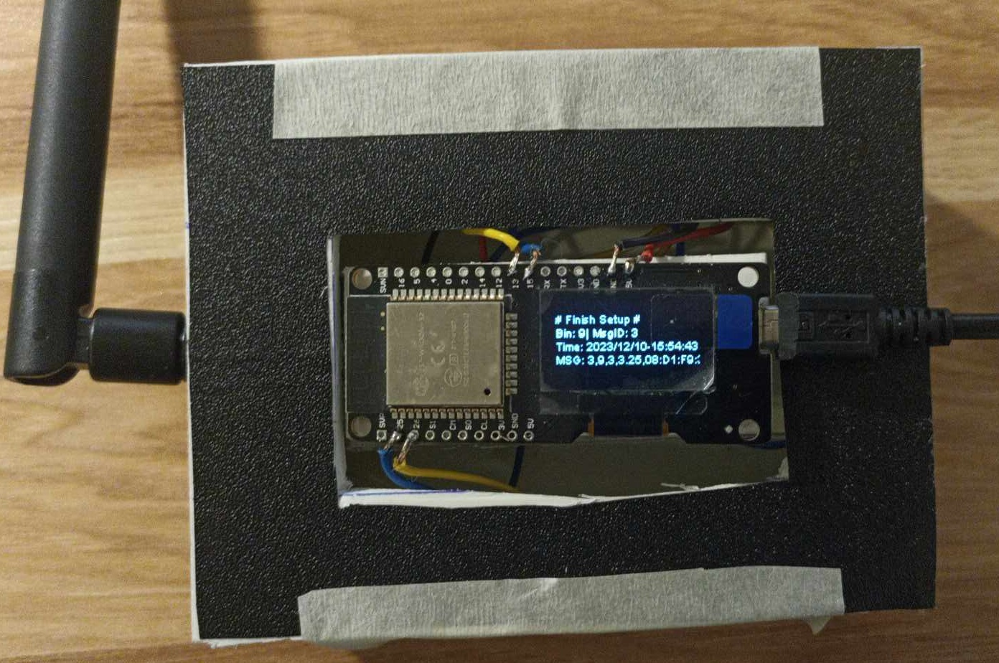

# SmartTM project user manual

## Introduction
SmartTM is a graduation project for the IoT major of FPT University. The developing team of SmartTM launched a system that allows collecting trash data from trash bins and displaying them to the web.

## Hardware manual
### Download Arduino IDE from https://www.arduino.cc/

### To use End Node

- For prototype 1 and 2, choose ESP32 dev board in Arduino IDE. For prototype 3, choose ESP32C3 dev board. 

- Use DIP switch to configure ID. 
- The battery is rechareable.

### To use Gateway

Choose ESP32 dev board in Arduino IDE. \
Gateway have Wifi AP mode for Wifi configuration:

Connect to Gateway using your own WiFi and enter personal Wifi SSID and password.

When the setup is completed, the LCD screen displays like this.

 

